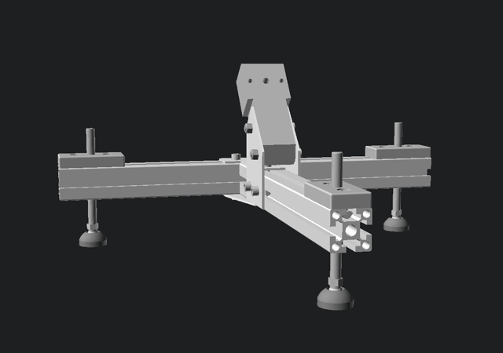
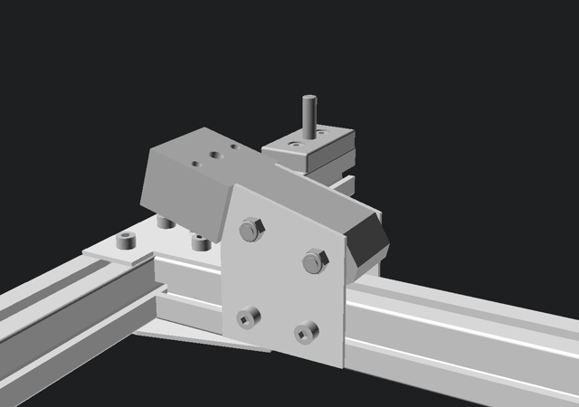
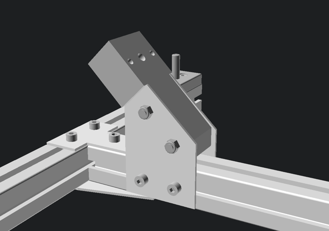

### Введение

Во время локдауна весной 2020 года я разработал и изготовил стабильный и компактный трипод для астротрекера, который позволяет с высокой точностью выставлять полярную ось. Трипод собирается из готовых деталей как конструктор. Он хорошо подходит для экспедиций в отдалённые регионы Земли, например, для наблюдения солнечных затмений. Собственно, именно для фотографирования солнечного затмения 14 декабря 2020 года я создал этот трипод.

Распространённая проблема при фотографировании полной фазы солнечного затмения --- нестабильность штатива фотокамеры или монтировки телескопа. Цена неправильного выбора штатива для фотографирования полного солнечного затмения очень велика, могут быть испорчены снимки редкого явления и второй попытки нет.

Здесь я подробно опишу конструкцию моего трипода для того, чтобы любой желающий мог повторить его и использовать. Разумеется, использование трипода не ограничивается съемкой солнечных затмений, он применим и для более стандартной ночной астрофотографии.

### Описание трипода

Трипод состоит из Т-образной рамы, трёх винтовых опор и экваториального клина. 

#### Рама

Рама состоит из двух отрезков алюминиевого конструкционного профиля сечением 45x45 мм. Конструкционный профиль имеет стандартные крепёжные пазы по длине. В эти пазы вкладываются Т-гайки и винтами прижимаются необходимые детали. Такой профиль разного сечения широко используется для сооружения самых разнообразных конструкций и его без проблем можно заказать с доставкой, например, в [Соберизавод](https:/soberizavod.ru). Там же можно приобрести остальные комплектующие: соединительные пластины, крепёж, опорные винты. В онлайн-форме магазина при заказе нужно указать необходимую длину распила. К сожалению, в Соберизавод не сверлят отверстия в профиле, а они необходимы для установки опор в раму. Поэтому, если у вас нет доступа к сверлильному станку, можно попробовать заказать в [Алюмика](https://алюмика.рф), там есть услуга по сверлению отверстий.

Для конструкционного профиля каждого сечения существует облегчённая, стандартная и усиленная версия профиля. Для своего трипода я выбрал стандартный профиль. Удельная масса такого профиля 1.6 кг/м при сечении 45x45 мм. Практика показала, что стандартный профиль имеет большой запас прочности. Поэтому, если есть необходимость сделать трипод ещё легче, то можно спокойно использовать SL-профиль, который имеет удельную массу 1.24 кг/м. 

Размеры сторон рамы 400 мм и 552 мм. Короткая сторона распологается в направлении север-юг, а длинная --- запад-восток. Длины сторон выбраны таким образом, чтобы опорные винты распологались в углах правильного треугольника. Читатель может пропорционально изменить размеры сторон на своё усмотрение, однако текущие значения близки к оптимальным.

В коротком профиле нужно просвердить одно отверстие, а в длинном --- два. Отверстия должны быть диаметром 17 мм и их центр должен быть в 45 мм от края. В эти отверстия снизу запрессовывается резбовая втулка для опорного винта.

Профили соединяются друг с другом A-образной пластиной снизу и Т-образной сверху. А-образная пластина одновременно служит ребром жесткости. А сверху должна быть именно Т-образная пластина, для того, чтобы не блокировать продольное перемещение экваториального клина. Клин желательно расположить так, чтобы центр масс всей системы (вместе с трекером, камерой и объективом) проецировался как можно ближе к центру треугольника.  

#### Винтовые опоры

В качестве опоры служит винт M12 с шаровой головкой и гайкой. Головка вкладывается в металлическую пятку с соответствующей выемкой. Резьба для винта находится в двух местах: в резьбовой втулке (внизу) и в адаптере (вверху). Так можно регулировать зазор в резьбе и устранять люфт. Ниже описана процедура выборки люфта. Адаптер крепится к раме Т-гайками и винтами, а втулка запрессовывается в отверстие. Фактически, её можно просто аккуратно заколотить молотком. 

Винтами выставляется полярная ось трекера. Вращением переднего винта регулируется высота полярной оси трекера.

Вращением правого и левого винта регулируется азимут полярной оси трекера.

#### Экваториальный клин

Экваториальный клин служит для крепления трекера к триподу и грубой установки высоты полярной оси трекера. Клин крепится к раме угловыми соединительными пластинами. В продаже есть пластины с углом 0, 15, 30, 45, 60, 90 градусов.

Три пары отверстий в клине позволяют сдвинуть его на пять разных значений относительно угла пластины: -10, -5, 0, +5, +10 градусов. В комбинации с разными угловыми соединительными пластинами можно ступенчато покрыть весь диапазон от 0 до 90 градусов с шагом 5 градусов. Окончательное выставление полярной оси производится опорными винтами.

#### Версия трипода с вертикальной колонной
Если высоты крепления трекера не хватает, то можно установить дополнительно вертикальную колонну из профиля 45x90 мм. Колонна крепится к триподу двумя L-образными соединительными пластинами и одной A-образной.

#### Приложение 1: Устранение люфта опорного винта

Для устранения люфта опорного винта нужно выкрутить винты адаптера, повернуть его на 180 градусов, вкрутить и затянуть винты адаптера обратно. При повороте адаптера образуется небольшой зазор между ним и рамой и при затягивании винтов этот зазор исчезает за счёт сдвига резьбовой втулки вниз. При этом происходит надёжный прижим опорного винта к резьбам адаптера и втулки и люфт исчезает. Если после нескольких устранений люфта втулка выдвинулась слишком сильно, её можно забить обратно молотком, предварительно выкрутив опорный винт.   

